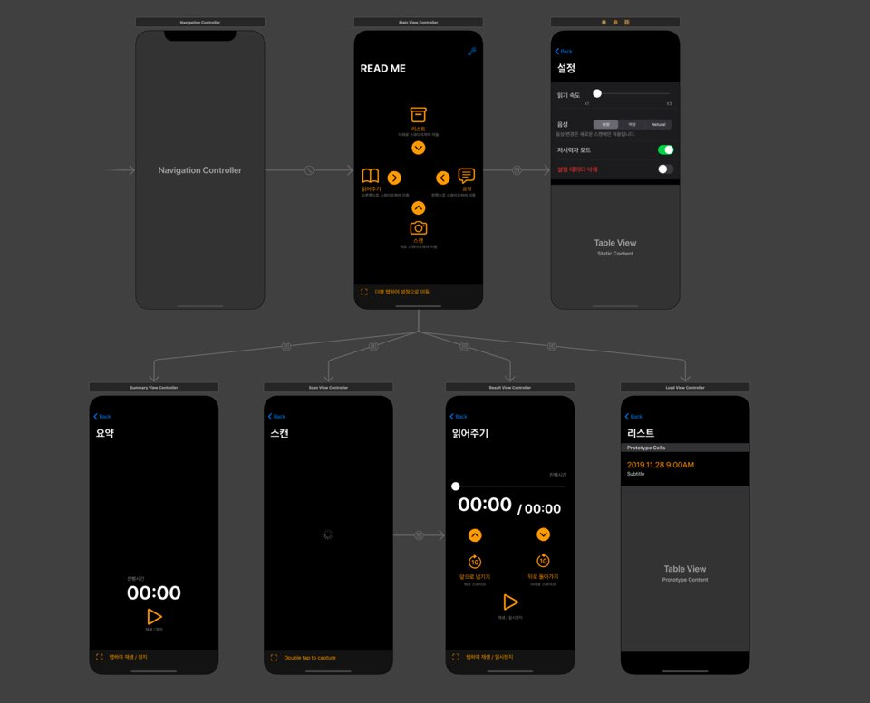
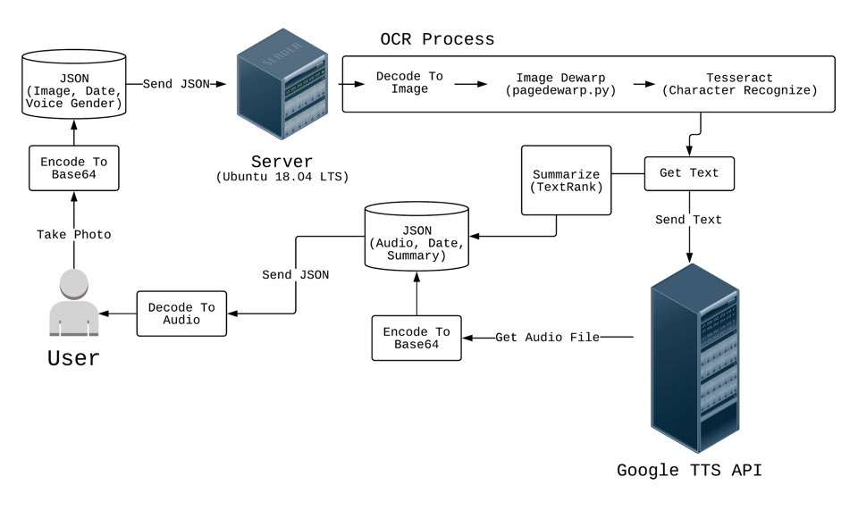

# Read Me
## I. 프로젝트 설명
### 1. 프로젝트 목적
- 시각장애인 또는 저시력자들의 종이책 읽기를 도와줄 수 있음
- 일반 사용자들이 OCR를 통해 종이책을 들을 수 있게 함
### 2. 프로젝트 특징
- 제스쳐(Gesture) 기반의 UI : 저시력자들을 위해 버튼을 최소화하고 제스쳐만으로 조작할 수 있게 함

### 3. 프로세스

## II. 서버 설정
|| /Base64Image| /GetChar|
| ------ | ------ | ------ |
| REQUEST| JSON| Binary File|
| RETURN| JSON|  JSON|
### 1. /Base64Image
 - Request : JSON (Image)
```json
{
        "image" : "image_base64", "date" : "current_date", "gender" : "gender_voice"
}
```
- `image_base64` : 이미지를 Base64로 인코딩한 String
- `current_date` : 이미지를 보낸 시각 (파일 이름)
- `gender` : 음성의 성별 (`"M"` : Man, `"W"` : Woman, `"N"` : Neutral)
---
- Return : JSON (Audio)
```json
{
        "audio" : "audio_base64", "date" : "date", "summary" : "summary_str"
}
```
- `audio_base64` : Base64로 인코딩된 오디오
`audio_base64` 텍스트의 맨 앞부분 문자 2개와 맨 뒷부분 문자 1개를 제거해야하 함
-ex) `b'//NExAASUJmQAUwYAL/Q4JAkCQoK4EAOEyJeZn7+L17/'` -> `//NExAASUJmQAUwYAL/Q4JAkCQoK4EAOEyJeZn7+L17/`
- `date` : 리퀘스트를 보낸 시각 (저장할 때 이용)
- `summary_str` : 요약 String

### 2. /GetChar
 - Request : Binary File (Image)
---
- Return : JSON (Audio)
```json
{
        "audio" : "audio_base64"
}
```
- `audio_base64` : Base64로 인코딩된 오디오
